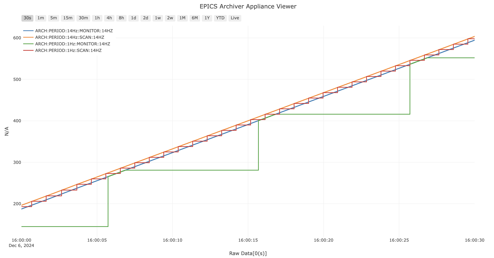

# Example IOC for Archiver

IOC with example PVs to demonstrate the difference between the archiving policies.

Creates the PVs:

```
ARCH:PERIOD:14Hz:MONITOR:14HZ
ARCH:PERIOD:1Hz:MONITOR:14HZ
ARCH:PERIOD:14Hz:SCAN:14HZ
ARCH:PERIOD:1Hz:SCAN:14HZ
```

The monitor PVs start at 0 and ramp up to 840 at 14Hz.
The scan PVs start at 10 and ramp up to 850 at 14Hz.



## Installation

Install the dependencies

```bash
python -m venv venv
source venv/bin/activate
git clone https://gitlab.esss.lu.se/ics-software/py-epicsarchiver.git
cd py-epicsarchiver
pip install .
cd ..
pip install p4p
```